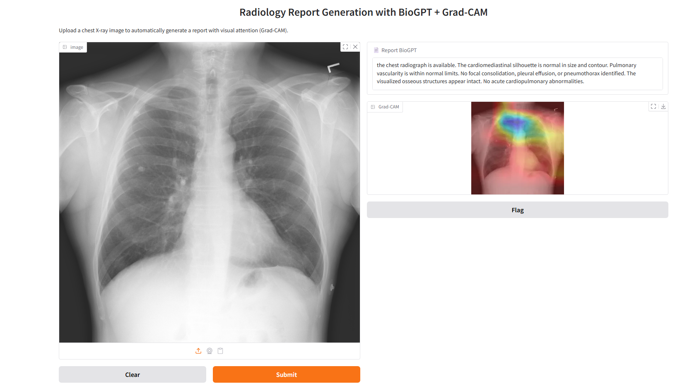
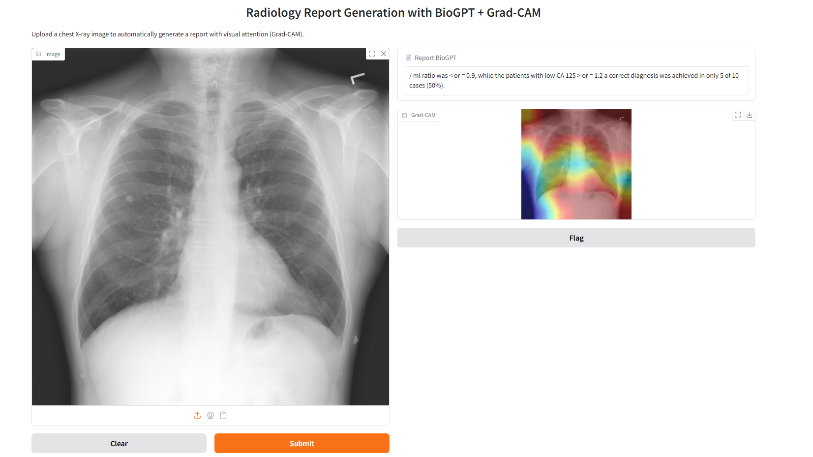

# CheX_Clinical_Project(modifications and changes will be made soon)

## Overview

This project aims to compare the performance of various natural language models in generating clinical reports based on descriptions of medical findings. The data used consists of reports from the **Indiana Reports** dataset.

The analysis focuses on both general-purpose and biomedical models, including:

- **BioGPT**
- **BioGPT-Large**
- **GPT-2**
- **Phi-2**

Quantitative and qualitative evaluations are conducted using standard metrics such as BLEU and ROUGE, as well as manual inspection of generated outputs.

## Evaluation Metrics

- **BLEU-1/2/4**: measures lexical accuracy via n-grams.
- **ROUGE-L**: measures similarity based on longest common subsequences.
- (Planned) **BERTScore**: will evaluate semantic similarity between reference and generation.

### Visual Comparison: Fine-tuned vs. Original BioGPT

The following images compare BioGPT outputs after 5 epochs of fine-tuning  with the original model.

**Fine-tuned (5 epochs)**

- Coherent report with clear radiological language and comprehensive coverage.
- Grad-CAM correctly focuses on the mediastinum and lung regions.

**Without Fine-tuning (Original BioGPT)**

- Generated text is irrelevant to the exam.
- Grad-CAM is diffuse and lacks clinical focus.

### Comparative Table of Metrics by Model

| Model               | BLEU-1 | BLEU-2 | BLEU-4 | ROUGE-L | Avg Inference Time (s) |
| ------------------- | ------ | ------ | ------ | ------- | ---------------------- |
| BioGPT              | 0.0553 | 0.0240 | 0.0091 | 0.0622  | 0.7301                 |
| Phi-2               | 0.0440 | 0.0161 | 0.0051 | 0.0801  | 82.0092                |
| BioGPT-Large        | 0.0336 | 0.0137 | 0.0045 | 0.0847  | 6.4947                 |
| GPT-2               | 0.0205 | 0.0072 | 0.0026 | 0.0808  | 3.1919                 |
| BioGPT (Fine-tuned with res50) | 0.2796 | 0.1492 | 0.0597 | 0.3614  | 4.7330                 |

- **BioGPT** showed the best BLEU performance.
- **BioGPT-Large** and **Phi-2** achieved the highest ROUGE-L.
- **GPT-2** had the lowest scores across all metrics.
- Qualitatively, only biomedical models produced clinically compatible text.

## Conclusion

The experiments demonstrated that fine-tuning BioGPT provides significant gains in both quantitative metrics and clinical coherence. The performance gap between general-purpose and biomedical models highlights the importance of domain-specific adaptation in medical report generation tasks. Fine-tuning BioGPT for just 5 epochs outperformed all other evaluated models, proving to be a promising and accessible solution even on moderately powered hardware.

## How to Use

- clone the repository
- pip install requirements
- dowload the Indiana report images from kaggle´s dataset
- dowload the fine-tuned model here: https://drive.google.com/file/d/1EEME4Rksg326YTnT2_1Zb-vxsa3YKmPH/view?usp=drive_link
- Make sure the paths to the model and data files are correct in the script
- Run `gradio_biogpt_interface_fixed.py` to test the model with Grad-CAM interface

## License

MIT

## Next Steps

- Perform fine-tuning of the used models to better adapt them to the specific medical domain.
- Evaluate alternative vision architectures (e.g., ConvNeXt, ViT, EfficientNet) instead of ResNet for extracting image embeddings.
- Explore advanced biomedical models like **PMC_LLaMA_7B** and **MedAlpaca**, which have around 7 billion parameters. However, these models present **hardware limitations** and are not feasible to run on a GPU with 12 GB VRAM, such as the one used in this project.

### System Configuration

This project was executed on the following machine:

- **Processor:** AMD Ryzen 5 5500
- **RAM:** 32 GB DDR4
- **GPU:** NVIDIA RTX 3060 with 12 GB VRAM

## Contact

For questions or collaboration: [davidrs@id.uff.br]
